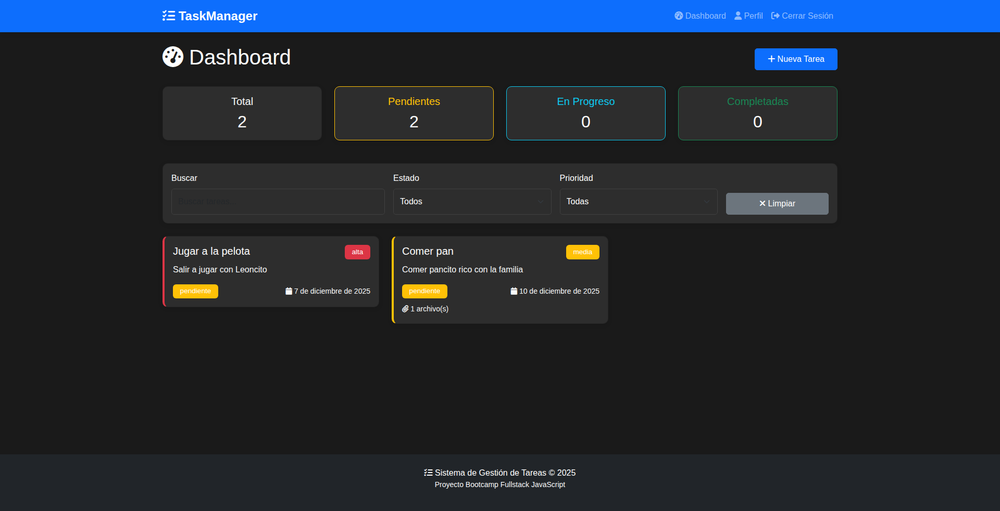

# Sistema de Gestión de Tareas



## Descripción

Sistema completo de gestión de tareas desarrollado con JavaScript Fullstack. Este proyecto permite a los usuarios crear, gestionar y dar seguimiento a sus tareas diarias con funcionalidades avanzadas como autenticación, adjuntar archivos, filtros y estadísticas en tiempo real.

**Tecnologías utilizadas:**

- **Frontend:** HTML5, CSS3, JavaScript ES6+, Bootstrap 5.3, Font Awesome
- **Backend:** Node.js, Express.js, Handlebars
- **Base de datos:** PostgreSQL con Sequelize ORM
- **Autenticación:** JWT (JSON Web Tokens) con bcryptjs
- **Carga de archivos:** Multer con validaciones y nombres únicos (UUID)

---

## Características Principales

### Autenticación y Seguridad

- Registro e inicio de sesión de usuarios
- Contraseñas encriptadas con bcryptjs
- Autenticación basada en JWT almacenado en cookies HttpOnly
- Middleware de protección de rutas
- Validación de formularios en frontend y backend

### Gestión de Tareas

- Crear, editar y eliminar tareas
- Establecer estado (Pendiente, En Progreso, Completada)
- Asignar prioridad (Alta, Media, Baja)
- Fecha de vencimiento
- Descripción detallada
- Adjuntar múltiples archivos (imágenes, PDF, documentos Office)

### Funcionalidades Avanzadas

- Dashboard con estadísticas en tiempo real
- Filtros por estado, prioridad y búsqueda de texto
- Visualización de detalles completos de cada tarea
- Gestión de perfil de usuario con avatar
- Cambio de contraseña
- Diseño responsive con Bootstrap 5.3

### Carga de Archivos

- Soporte para múltiples tipos de archivos
- Validación de tamaño (máx. 5MB por archivo)
- Nombres únicos con UUID + timestamp
- Almacenamiento del nombre original en la base de datos
- Visualización y descarga de archivos adjuntos

---

## Instalación y Configuración

### Requisitos Previos

- **Node.js** versión 22.18.0 (especificado en `.nvmrc`)
- **PostgreSQL** versión 12 o superior
- **npm** o **yarn** como gestor de paquetes

### Paso 1: Clonar el Repositorio

```bash
git clone <url-del-repositorio>
cd m9.evaluacion.modulo.portafolio
```

### Paso 2: Configurar Node.js

Este proyecto utiliza **Node.js 22.18.0**. Si usas `fnm` (Fast Node Manager), automáticamente detectará la versión desde el archivo `.nvmrc`:

```bash
# Instalar fnm si no lo tienes
curl -fsSL https://fnm.vercel.app/install | bash

# fnm automáticamente usará la versión en .nvmrc
fnm use
```

Alternativamente con `nvm`:

```bash
nvm install
nvm use
```

### Paso 3: Instalar Dependencias

```bash
npm install
```

Esto instalará todas las dependencias especificadas en `package.json` con versionado congelado a parches (`~`).

### Paso 4: Configurar Variables de Entorno

**IMPORTANTE:** Antes de ejecutar las migraciones, debes configurar el usuario inicial del sistema.

1. Abre el archivo `.env` en el directorio raíz del proyecto
2. Localiza las variables `FIRST_USER_EMAIL` y `FIRST_USER_PASSWORD`
3. Reemplaza los valores de ejemplo con tus propias credenciales:

```env
# Ejemplo - cambia estos valores por los tuyos
FIRST_USER_EMAIL=tu-email@ejemplo.com
FIRST_USER_PASSWORD=TuContraseñaSegura123!
```

El archivo `.env` ya está creado con las credenciales. **Configura el email y contraseña del primer usuario** editando estas variables:

```env
DB_HOST=localhost
DB_USER=bootcamp_user
DB_PASSWORD=Bootcamp1234
DB_NAME=m9_evaluacion
DB_PORT=5432
PORT=3000
JWT_SECRET=Mi$uper$ecretoJWT2025elmasdificildeladivinar!
FIRST_USER_EMAIL=tu-email@ejemplo.com
FIRST_USER_PASSWORD=TuContraseñaSegura123!
```

**Importante:** Cambia `FIRST_USER_EMAIL` y `FIRST_USER_PASSWORD` con tus propias credenciales antes de ejecutar las migraciones.

### Paso 5: Configurar la Base de Datos

La base de datos ya está creada. Para verificar:

```bash
sudo -u postgres psql -c "\l" | grep m9_evaluacion
```

### Paso 6: Ejecutar Migraciones

Este comando sincronizará los modelos con la base de datos y creará el usuario inicial:

```bash
npm run migrate
```

Salida esperada:
```
Iniciando proceso de migración...
Conexión a la base de datos establecida
Sincronizando modelos con la base de datos...
Modelos sincronizados correctamente
Creando usuario inicial...
Usuario inicial creado exitosamente
Migración completada exitosamente
```

### Paso 7: Iniciar el Servidor

**Modo desarrollo (con recarga automática):**

```bash
npm run dev
```

**Modo producción:**

```bash
npm start
```

El servidor estará disponible en: **http://localhost:3000**

---

## Estructura del Proyecto

```
m9.evaluacion.modulo.portafolio/
├── src/
│   ├── controllers/          # Controladores de lógica de negocio
│   │   ├── authController.js
│   │   ├── taskController.js
│   │   └── userController.js
│   ├── middlewares/          # Middlewares personalizados
│   │   ├── authMiddleware.js
│   │   └── uploadMiddleware.js
│   ├── models/               # Modelos de Sequelize
│   │   ├── index.js
│   │   ├── User.js
│   │   ├── Task.js
│   │   └── Attachment.js
│   ├── routes/               # Definición de rutas
│   │   ├── authRoutes.js
│   │   ├── taskRoutes.js
│   │   ├── userRoutes.js
│   │   └── pageRoutes.js
│   ├── views/                # Vistas de Handlebars
│   │   ├── layouts/
│   │   │   └── main.handlebars
│   │   ├── partials/
│   │   │   ├── navbar.handlebars
│   │   │   └── footer.handlebars
│   │   ├── home.handlebars
│   │   ├── login.handlebars
│   │   ├── register.handlebars
│   │   ├── dashboard.handlebars
│   │   ├── profile.handlebars
│   │   └── error.handlebars
│   ├── public/               # Archivos estáticos
│   │   ├── css/
│   │   │   └── styles.css
│   │   └── js/
│   │       ├── auth.js
│   │       ├── main.js
│   │       ├── login.js
│   │       ├── register.js
│   │       ├── tasks.js
│   │       └── profile.js
│   ├── scripts/              # Scripts de utilidad
│   │   ├── migrate.js
│   │   └── createInitialUser.js
│   └── server.js             # Punto de entrada de la aplicación
├── uploads/                  # Directorio para archivos cargados
├── .env                      # Variables de entorno
├── .nvmrc                    # Versión de Node.js
├── .gitignore
├── package.json
└── README.md
```

---

## Modelo de Base de Datos

### Tabla: `usuarios`

| Campo       | Tipo          | Descripción                          |
|-------------|---------------|--------------------------------------|
| id          | INTEGER       | Clave primaria autoincremental       |
| nombre      | VARCHAR(100)  | Nombre completo del usuario          |
| email       | VARCHAR(150)  | Email único del usuario              |
| password    | VARCHAR(255)  | Contraseña encriptada                |
| avatar      | VARCHAR(255)  | Ruta del avatar (opcional)           |
| rol         | ENUM          | 'usuario' o 'admin'                  |
| activo      | BOOLEAN       | Estado del usuario                   |
| createdAt   | TIMESTAMP     | Fecha de creación                    |
| updatedAt   | TIMESTAMP     | Fecha de actualización               |

### Tabla: `tareas`

| Campo              | Tipo          | Descripción                          |
|--------------------|---------------|--------------------------------------|
| id                 | INTEGER       | Clave primaria autoincremental       |
| titulo             | VARCHAR(200)  | Título de la tarea                   |
| descripcion        | TEXT          | Descripción detallada                |
| estado             | ENUM          | 'pendiente', 'en-progreso', 'completada' |
| prioridad          | ENUM          | 'alta', 'media', 'baja'              |
| fechaVencimiento   | DATE          | Fecha de vencimiento (opcional)      |
| userId             | INTEGER       | FK a usuarios                        |
| createdAt          | TIMESTAMP     | Fecha de creación                    |
| updatedAt          | TIMESTAMP     | Fecha de actualización               |

### Tabla: `adjuntos`

| Campo             | Tipo          | Descripción                          |
|-------------------|---------------|--------------------------------------|
| id                | INTEGER       | Clave primaria autoincremental       |
| nombreOriginal    | VARCHAR(255)  | Nombre original del archivo          |
| nombreArchivo     | VARCHAR(255)  | Nombre único generado (UUID)         |
| mimeType          | VARCHAR(100)  | Tipo MIME del archivo                |
| tamano            | INTEGER       | Tamaño en bytes                      |
| ruta              | VARCHAR(500)  | Ruta del archivo                     |
| taskId            | INTEGER       | FK a tareas                          |
| createdAt         | TIMESTAMP     | Fecha de creación                    |
| updatedAt         | TIMESTAMP     | Fecha de actualización               |

### Relaciones

- Un **Usuario** puede tener múltiples **Tareas** (1:N)
- Una **Tarea** puede tener múltiples **Adjuntos** (1:N)
- Eliminación en cascada activada

---

## API Endpoints

### Autenticación (`/api/auth`)

| Método | Ruta              | Descripción                  | Autenticación |
|--------|-------------------|------------------------------|---------------|
| POST   | `/register`       | Registrar nuevo usuario      | No            |
| POST   | `/login`          | Iniciar sesión               | No            |
| GET    | `/check`          | Verificar autenticación      | No            |
| POST   | `/logout`         | Cerrar sesión                | Sí            |
| GET    | `/profile`        | Obtener perfil actual        | Sí            |

### Tareas (`/api/tasks`)

| Método | Ruta              | Descripción                  | Autenticación |
|--------|-------------------|------------------------------|---------------|
| GET    | `/`               | Obtener todas las tareas     | Sí            |
| GET    | `/stats`          | Obtener estadísticas         | Sí            |
| GET    | `/:id`            | Obtener tarea por ID         | Sí            |
| POST   | `/`               | Crear nueva tarea            | Sí            |
| PUT    | `/:id`            | Actualizar tarea             | Sí            |
| DELETE | `/:id`            | Eliminar tarea               | Sí            |

### Usuarios (`/api/users`)

| Método | Ruta                  | Descripción                  | Autenticación |
|--------|-----------------------|------------------------------|---------------|
| GET    | `/profile`            | Obtener perfil               | Sí            |
| PUT    | `/profile`            | Actualizar perfil            | Sí            |
| PUT    | `/change-password`    | Cambiar contraseña           | Sí            |

### Rutas de Páginas

| Método | Ruta              | Descripción                  |
|--------|-------------------|------------------------------|
| GET    | `/`               | Página de inicio             |
| GET    | `/login`          | Página de login              |
| GET    | `/register`       | Página de registro           |
| GET    | `/dashboard`      | Dashboard de tareas          |
| GET    | `/profile`        | Página de perfil             |

---

## Frontend - Tecnologías

### Bootstrap 5.3

Se utiliza Bootstrap vía CDN para los componentes de interfaz:

- Sistema de grid responsive
- Componentes: cards, modals, forms, buttons, badges, alerts
- Utilidades de espaciado y alineación

### Font Awesome

Iconografía completa para mejorar la UX:

```html
<link rel="stylesheet" href="https://cdnjs.cloudflare.com/ajax/libs/font-awesome/6.5.1/css/all.min.css">
```

### JavaScript Vanilla

Todo el código de frontend está escrito en JavaScript puro (ES6+) sin frameworks adicionales:

- Fetch API para comunicación con el backend
- LocalStorage para persistencia del token JWT
- Manipulación del DOM
- Event listeners y delegación de eventos

---

## Seguridad

### Autenticación JWT

1. **Generación:** Al iniciar sesión o registrarse, se genera un token JWT firmado con `JWT_SECRET`
2. **Almacenamiento:** El token se guarda en cookies HttpOnly (backend) y localStorage (frontend)
3. **Validación:** Cada petición a rutas protegidas verifica el token mediante middleware
4. **Expiración:** Los tokens expiran después de 7 días

### Contraseñas

- Encriptadas con **bcryptjs** usando salt de 10 rounds
- Nunca se retornan en las respuestas JSON (método `toJSON()` personalizado)
- Validación de complejidad en frontend y backend

### Carga de Archivos

- Validación de tipos MIME permitidos
- Límite de tamaño: 5MB por archivo
- Máximo 5 archivos por solicitud
- Nombres únicos generados con UUID + timestamp para evitar colisiones
- Directorio `uploads/` fuera del directorio público

### Validaciones

- **Backend:** Validaciones de Sequelize a nivel de modelo
- **Frontend:** Validación HTML5 y JavaScript
- Sanitización de inputs
- Manejo de errores consistente

---

## Funcionalidades del Frontend

### LocalStorage

Se utiliza para almacenar el token JWT y mantener la sesión del usuario:

```javascript
// Guardar token
localStorage.setItem('authToken', token);

// Obtener token
const token = localStorage.getItem('authToken');

// Eliminar token
localStorage.removeItem('authToken');
```

### Gestión del Estado

Las estadísticas en el dashboard se actualizan automáticamente:

```javascript
async function loadStats() {
  const response = await fetch('/api/tasks/stats');
  const data = await response.json();
  // Actualizar DOM con las estadísticas
}
```

### Filtros Dinámicos

Los usuarios pueden filtrar tareas por:
- Búsqueda de texto (título y descripción)
- Estado (pendiente, en progreso, completada)
- Prioridad (alta, media, baja)

### Modales Bootstrap

Se utilizan modales para:
- Crear/editar tareas
- Ver detalles de tareas
- Confirmaciones de eliminación

---

## Conceptos de Aprendizaje

Este proyecto está diseñado para que desarrolladores junior aprendan:

### Backend (Node.js + Express)

1. **Arquitectura MVC:** Separación clara entre modelos, vistas y controladores
2. **ORM Sequelize:** Definición de modelos, relaciones y migraciones
3. **Middlewares:** Autenticación, validación y manejo de errores
4. **APIs RESTful:** Diseño de endpoints siguiendo convenciones REST
5. **Seguridad:** JWT, bcryptjs, validaciones

### Frontend

1. **JavaScript moderno (ES6+):** Arrow functions, async/await, destructuring
2. **Fetch API:** Comunicación asíncrona con el backend
3. **DOM Manipulation:** Renderizado dinámico de contenido
4. **LocalStorage:** Persistencia de datos en el navegador
5. **Bootstrap:** Framework CSS para diseño responsive

### Base de Datos

1. **PostgreSQL:** Base de datos relacional
2. **Relaciones:** One-to-Many con integridad referencial
3. **Migraciones:** Sincronización de modelos con Sequelize

### DevOps Básico

1. **Variables de entorno:** Configuración con `.env`
2. **Gestión de versiones:** Node.js con `fnm`/`nvm`
3. **Scripts NPM:** Automatización de tareas

---

## Troubleshooting

### Error: "Cannot find module"

```bash
# Reinstalar dependencias
rm -rf node_modules package-lock.json
npm install
```

### Error de conexión a PostgreSQL

```bash
# Verificar que PostgreSQL esté corriendo
sudo systemctl status postgresql

# Verificar credenciales en .env
cat .env | grep DB_
```

### Error: "Port 3000 is already in use"

```bash
# Cambiar el puerto en .env
PORT=3001

# O matar el proceso en el puerto 3000
lsof -ti:3000 | xargs kill -9
```

### Los archivos no se suben

```bash
# Verificar permisos del directorio uploads
chmod 755 uploads/

# Verificar que existe
mkdir -p uploads
```

---

## Recursos Adicionales

### Documentación Oficial

- [Node.js](https://nodejs.org/docs/)
- [Express.js](https://expressjs.com/)
- [Sequelize](https://sequelize.org/)
- [Bootstrap 5](https://getbootstrap.com/docs/5.3/)
- [PostgreSQL](https://www.postgresql.org/docs/)

### Tutoriales Recomendados

- [Express.js Tutorial - MDN](https://developer.mozilla.org/en-US/docs/Learn/Server-side/Express_Nodejs)
- [Sequelize ORM Tutorial](https://sequelize.org/docs/v6/getting-started/)
- [JWT Authentication Tutorial](https://jwt.io/introduction)

---

## Contribuciones

Este es un proyecto educativo. Si encuentras errores o tienes sugerencias:

1. Crea un issue describiendo el problema
2. Haz un fork del proyecto
3. Crea una rama con tu mejora
4. Envía un pull request

---

## Licencia

Este proyecto está bajo la licencia MIT. Puedes usarlo libremente para aprender y practicar.

---

## Autor

Carlos Pizarro Morales

Desarrollado como proyecto final del módulo 9

---

## ¡Éxito!

Si has llegado hasta aquí y el proyecto está funcionando, ¡felicidades!

Has implementado un sistema completo fullstack con:
- Autenticación segura con JWT
- CRUD completo de tareas
- Carga de archivos con Multer
- Base de datos PostgreSQL con Sequelize
- Frontend responsive con Bootstrap
- Validaciones completas
- Documentación exhaustiva

**Siguiente paso:** Personaliza el proyecto, añade nuevas funcionalidades y mejora el diseño. ¡El límite es tu creatividad!

